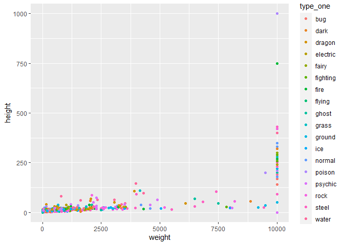
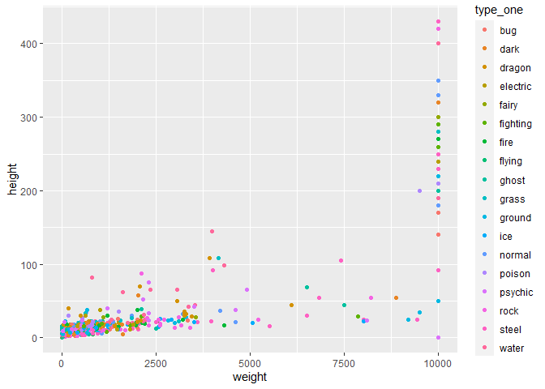

Pokemon API Vignette
================
Mark Austin
10/05/2021

-   [Required R Packages](#required-r-packages)
-   [Pokemon API Query and Data Proccessing
    Functions](#pokemon-api-query-and-data-proccessing-functions)
    -   [Pokemon Endpoint Functions.](#pokemon-endpoint-functions)
-   [Exploring Data](#exploring-data)

## Required R Packages

The following R packages are required to run R code used in this
Vignette and/or create this document.

-   `tidyverse` The tidyverse package is used for data handling and
    plotting.

-   `jsonlite` The jsonlite package is used to contact the API and
    return data.

-   `knitr` The knitr package is used for document image handling.

-   `rmarkdown` The rmarkdown package is used by a render program to
    render this document.

## Pokemon API Query and Data Proccessing Functions

I created the following functions to query and process data from the
[Pokemon API](https://pokeapi.co/) using [Pokemon API
Documentation](https://pokeapi.co/docs/v2).

### Pokemon Endpoint Functions.

Most data relevant to individual pokemon is obtained from the [Pokemon
endpoint](https://pokeapi.co/docs/v2#pokemon). This endpoint returns a
complex list of lists with more data than most users would need. I’ve
provided three functions to query and process pokemon endpoint data.

1.  `getPokeNameIDFunction`

``` r
getPokeNameID <- function(sortName=FALSE){
  
  apiData<-fromJSON("https://pokeapi.co/api/v2/pokemon/?limit=1222")
  
  allNames<-as_tibble(apiData$results)
  
  allNames<-allNames %>% mutate(ID=as.numeric(basename(url)))
  
  if (sortName) {
    allNames<-allNames %>% arrange(name)
  }
  
  return(allNames)
  
}
```

Example usage with output

``` r
head(getPokeNameID(sortName = TRUE))
```

<div class="kable-table">

| name           | url                                        |    ID |
|:---------------|:-------------------------------------------|------:|
| abomasnow      | <https://pokeapi.co/api/v2/pokemon/460/>   |   460 |
| abomasnow-mega | <https://pokeapi.co/api/v2/pokemon/10060/> | 10060 |
| abra           | <https://pokeapi.co/api/v2/pokemon/63/>    |    63 |
| absol          | <https://pokeapi.co/api/v2/pokemon/359/>   |   359 |
| absol-mega     | <https://pokeapi.co/api/v2/pokemon/10057/> | 10057 |
| accelgor       | <https://pokeapi.co/api/v2/pokemon/617/>   |   617 |

</div>

``` r
getOnePokeData<-function(pokemon,basestat=FALSE,type=FALSE){
  
  ##Get list of pokemon and process user pokemon input
  pokeNameID<-getPokeNameID()
  
  if (is.numeric(pokemon)){
    pokeNameID<-pokeNameID%>%filter(ID==pokemon)
  } else if (is.character(pokemon)){
    pokeNameID<-pokeNameID%>%filter(name==tolower(pokemon))
  } else {
    stop("Please enter either pokemon integer or quoated name value")
  }
  
  PokeList<- fromJSON(pokeNameID$url,flatten = TRUE)
  
  ###Function Default Data
  name<-PokeList$name
  height<-PokeList$height
  id<-PokeList$id
  species<-PokeList$species$name
  weight<-PokeList$weight
  base_experience<-PokeList$base_experience
  
  LocalDF<-data.frame(name,id,species,height,weight,base_experience)
  
  ##process and add base stat data if user selects basestat TRUE
  if (basestat){
    hp<-PokeList$stats$base_stat[1]
    attack<-PokeList$stats$base_stat[2]
    defense<-PokeList$stats$base_stat[3]
    special_attack<-PokeList$stats$base_stat[4]
    special_defense<-PokeList$stats$base_stat[5]
    speed<-PokeList$stats$base_stat[6]
    
    LocalDF<-LocalDF%>%mutate(hp,attack,defense,special_attack   ,special_defense ,speed)
  }
  
  ##process and add type data if user selects type TRUE
  if(type){
    ##All pokemon has at least one type so assign here
    type_one<-PokeList$types$type.name[1]
    
    ##check if more than one type and set 
    ##second type as needed
    if(length(PokeList$types$slot)>1){
      type_two<-PokeList$types$type.name[2]
    }else{
      type_two<-"None"
    }
    
    LocalDF<-LocalDF%>%mutate(type_one,type_two)
  }
  
  
  return(LocalDF)
  
}
```

Examples of ways to use getOnePokeData()

``` r
getOnePokeData("Venusaur")
getOnePokeData(pokemon=8,basestat = TRUE)
getOnePokeData(435,type = TRUE)
getOnePokeData(10032,basestat = TRUE,type = TRUE)
```

``` r
getEveryPokeData<-function(basestat=FALSE,type=FALSE){
  
  ###Get current number of pokemon to process
  #getPokeNameID
  pokeNameID<-getPokeNameID()
  idVals<-pokeNameID$ID
  #idVals<-1:2
  
  ###Loop through every pokemon and build data frame
  ###by adding new rows
  ###Most of the time spent here is in the numerous 
  ###   calls to API address since there are so many pokemon
  allPoke<-data.frame()
  for (i in idVals) {
    allPoke<-rbind(allPoke,getOnePokeData(i,basestat,type))
  }
  
  return(allPoke)
}
#getEveryPokeData()
```

\#\#\#Species Endpoint Functions

``` r
getSpeciesNameID <- function(sortName=FALSE){
  
  apiData<-fromJSON("https://pokeapi.co/api/v2/pokemon-species/?limit=1222")
  
  allNames<-as_tibble(apiData$results)
  
  allNames<-allNames %>% mutate(ID=as.numeric(basename(url)))
  
  if (sortName) {
    allNames<-allNames %>% arrange(name)
  }
  
  return(allNames)
  
}
```

``` r
getOneSpeciesData<-function(species){
   
   ##Get list of species and process user species input
   pokeSpeciesID<-getSpeciesNameID()
   
   if (is.numeric(species)){
     pokeSpeciesID<-pokeSpeciesID%>%filter(ID==species)
   } else if (is.character(species)){
     pokeSpeciesID<-pokeSpeciesID%>%filter(name==tolower(species))
   } else {
     stop("Please enter either species integer or quoated name value")
   }
   
   PokeList<- fromJSON(pokeSpeciesID$url,flatten = TRUE)
   
   ###Function Data to return
   species<-PokeList$name
   shape<-PokeList$shape$name
   generation<-PokeList$generation$name
   base_happiness<-PokeList$base_happiness
   capture_rate<-PokeList$capture_rate
   gender_rate<-PokeList$gender_rate
   hatch_counter<-PokeList$hatch_counter
   is_baby<-PokeList$is_baby
   is_legendary<-PokeList$is_legendary
   is_mythical<-PokeList$is_mythical

   
   LocalDF<-data.frame(species,shape,generation,base_happiness,capture_rate,gender_rate,hatch_counter,is_baby,is_legendary,is_mythical)
   

   
   return(LocalDF)
   
 }
```

``` r
getEverySpeciesData<-function(){
   
   ###Get current number of pokemon to process
   #getPokeNameID
   pokeSpeciesID<-getSpeciesNameID()
   idVals<-pokeSpeciesID$ID
   
   
   ###Loop through every species and build data frame
   ###by adding new rows
   ###Most of the time spent here is in the numerous 
   ###   calls to API address since there are so many species
   allPoke<-data.frame()
   for (i in idVals) {
     allPoke<-rbind(allPoke,getOneSpeciesData(i))
   }
   
   return(allPoke)
 }
```

``` r
getOneEvolveData<-function(queryURL){
  queryResult<-fromJSON(queryURL)
  #print(queryResult)
  #print(queryResult$chain$species$name)
  stageOne<-queryResult$chain$species$name
  stageTwo<-queryResult[["chain"]][["evolves_to"]][["species"]][["name"]]
  stageThree<-queryResult[["chain"]][["evolves_to"]][["evolves_to"]][[1]][["species"]][["name"]] 
  if (is.null(stageTwo)){
    stageTwo<-"None"
  }
  if (is.null(stageThree)){
    stageThree<-"None"
  }
  #print(stageThree)
  
  localDF<-data.frame(stageOne,stageTwo,stageThree)
  return(localDF)
}
```

``` r
getAllEvolveSeries<-function(){
  
  metaEvolve<-fromJSON("https://pokeapi.co/api/v2/evolution-chain/?limit=600")
  
  allEvolve<-data.frame()
  for (loopURL in metaEvolve$results$url) {
    #print(loopURL)
    allEvolve<-rbind(allEvolve,getOneEvolveData(loopURL))
    
  } 
  
  return(allEvolve)
}

resultsEvolve<-getAllEvolveSeries()
head(resultsEvolve)
```

<div class="kable-table">

| stageOne   | stageTwo   | stageThree |
|:-----------|:-----------|:-----------|
| bulbasaur  | ivysaur    | venusaur   |
| charmander | charmeleon | charizard  |
| squirtle   | wartortle  | blastoise  |
| caterpie   | metapod    | butterfree |
| weedle     | kakuna     | beedrill   |
| pidgey     | pidgeotto  | pidgeot    |

</div>

``` r
getAllEvolveStages<-function(){
  
  resultsEvolve<-getAllEvolveSeries()
  
  ###Handles the first one which they all have
  ###Now can do stageTwo and three
  allEvolve<-data.frame()
  species<-resultsEvolve$stageOne
  stages<-ifelse(resultsEvolve$stageTwo=="None",stage<-"noEvolve",stage<-"one")
  stages
  allEvolve<-data.frame(species,stages)
  ###Need to use rbind to add other parts after this part
  species<-resultsEvolve$stageTwo
  stages<-ifelse(resultsEvolve$stageTwo=="None",stage<-"noEvolve",stage<-"two")
  twoEvolve<-data.frame(species,stages)
  twoEvolve<-twoEvolve %>% filter(species!="None")
  allEvolve<-rbind(allEvolve,twoEvolve)
  
  species<-resultsEvolve$stageThree
  stages<-ifelse(resultsEvolve$stageThree=="None",stage<-"noEvolve",stage<-"three")
  threeEvolve<-data.frame(species,stages)
  threeEvolve<-threeEvolve %>% filter(species!="None")
  allEvolve<-rbind(allEvolve,threeEvolve)
  ###Later use distinct function to remove duplicate rows
  allEvolve<-allEvolve %>% distinct(species,.keep_all = TRUE)
  
  allEvolve$stages<-as.factor(allEvolve$stages)
  allEvolve$stages<-ordered(allEvolve$stages,levels=c("one","two","three","noEvolve"))
  
  return(allEvolve)
}

evolveStages<-getAllEvolveStages()
head(evolveStages)
```

<div class="kable-table">

| species    | stages |
|:-----------|:-------|
| bulbasaur  | one    |
| charmander | one    |
| squirtle   | one    |
| caterpie   | one    |
| weedle     | one    |
| pidgey     | one    |

</div>

``` r
str(evolveStages)
```

    ## 'data.frame':    897 obs. of  2 variables:
    ##  $ species: chr  "bulbasaur" "charmander" "squirtle" "caterpie" ...
    ##  $ stages : Ord.factor w/ 4 levels "one"<"two"<"three"<..: 1 1 1 1 1 1 1 1 1 1 ...

## Exploring Data

``` r
allPoke<-getEveryPokeData(basestat = TRUE,type = TRUE)
allSpecies<-getEverySpeciesData()
```

``` r
#table(allPoke$type_one,allPoke$species)
#allPoke %>% distinct()
#inner_join(allPoke,evolveStages,by="species") %>% select(name,stages,everything())

combinePoke<-inner_join(allPoke,evolveStages,by="species") %>% select(name,stages,everything())

tOne<-table(combinePoke$stages,combinePoke$type_one )
tOne<-table(combinePoke$type_one,combinePoke$stages )
kable(addmargins(tOne),caption = "Contingency Table of Type by Stage")
```

|          | one | two | three | noEvolve |  Sum |
|:---------|----:|----:|------:|---------:|-----:|
| bug      |  27 |  34 |    12 |       11 |   84 |
| dark     |  16 |  19 |     4 |        9 |   48 |
| dragon   |   7 |   9 |    10 |       17 |   43 |
| electric |  12 |  31 |     8 |       26 |   77 |
| fairy    |   7 |  10 |     3 |        4 |   24 |
| fighting |  13 |  20 |     3 |        9 |   45 |
| fire     |  18 |  25 |    15 |       11 |   69 |
| flying   |   2 |   2 |     2 |        3 |    9 |
| ghost    |  15 |  16 |     5 |       10 |   46 |
| grass    |  31 |  38 |    19 |        8 |   96 |
| ground   |  16 |  17 |     3 |        6 |   42 |
| ice      |  11 |  16 |     4 |        8 |   39 |
| normal   |  43 |  39 |    11 |       25 |  118 |
| poison   |  16 |  21 |     3 |        3 |   43 |
| psychic  |  18 |  19 |    12 |       31 |   80 |
| rock     |  20 |  20 |     7 |       26 |   73 |
| steel    |   8 |  12 |     7 |       13 |   40 |
| water    |  45 |  54 |    20 |       22 |  141 |
| Sum      | 325 | 402 |   148 |      242 | 1117 |

Contingency Table of Type by Stage

``` r
head(allPoke)
```

<div class="kable-table">

| name       |  id | species    | height | weight | base\_experience |  hp | attack | defense | special\_attack | special\_defense | speed | type\_one | type\_two |
|:-----------|----:|:-----------|-------:|-------:|-----------------:|----:|-------:|--------:|----------------:|-----------------:|------:|:----------|:----------|
| bulbasaur  |   1 | bulbasaur  |      7 |     69 |               64 |  45 |     49 |      49 |              65 |               65 |    45 | grass     | poison    |
| ivysaur    |   2 | ivysaur    |     10 |    130 |              142 |  60 |     62 |      63 |              80 |               80 |    60 | grass     | poison    |
| venusaur   |   3 | venusaur   |     20 |   1000 |              236 |  80 |     82 |      83 |             100 |              100 |    80 | grass     | poison    |
| charmander |   4 | charmander |      6 |     85 |               62 |  39 |     52 |      43 |              60 |               50 |    65 | fire      | None      |
| charmeleon |   5 | charmeleon |     11 |    190 |              142 |  58 |     64 |      58 |              80 |               65 |    80 | fire      | None      |
| charizard  |   6 | charizard  |     17 |    905 |              240 |  78 |     84 |      78 |             109 |               85 |   100 | fire      | flying    |

</div>

``` r
g<-ggplot(data = allPoke,aes(x=weight,y=height))
g+geom_point(aes(color=type_one))
```

<!-- -->

``` r
allPoke %>% group_by(type_one) %>% summarise(mweight=mean(weight),sdweight=sd(weight))
```

<div class="kable-table">

| type\_one |   mweight | sdweight |
|:----------|----------:|---------:|
| bug       |  576.4471 | 1560.404 |
| dark      |  786.3750 | 1874.439 |
| dragon    | 1331.1628 | 1384.587 |
| electric  |  704.8442 | 1936.162 |
| fairy     |  787.7917 | 2128.368 |
| fighting  | 1398.5111 | 2617.478 |
| fire      | 1061.4928 | 2071.127 |
| flying    | 1477.5556 | 3211.211 |
| ghost     |  802.0870 | 2024.955 |
| grass     |  800.3542 | 2032.037 |
| ground    | 1540.1905 | 2777.023 |
| ice       | 1094.7692 | 1570.560 |
| normal    |  682.6271 | 1659.021 |
| poison    | 1050.6279 | 2456.101 |
| psychic   |  891.5750 | 1925.071 |
| rock      | 1111.0548 | 1718.358 |
| steel     | 2850.1500 | 3478.657 |
| water     |  926.2199 | 1914.515 |

</div>

``` r
allPoke %>% summary()
```

    ##      name                 id            species              height       
    ##  Length:1118        Min.   :    1.0   Length:1118        Min.   :   1.00  
    ##  Class :character   1st Qu.:  280.2   Class :character   1st Qu.:   5.00  
    ##  Mode  :character   Median :  559.5   Mode  :character   Median :  10.00  
    ##                     Mean   : 2350.6                      Mean   :  21.43  
    ##                     3rd Qu.:  838.8                      3rd Qu.:  16.00  
    ##                     Max.   :10220.0                      Max.   :1000.00  
    ##      weight        base_experience       hp             attack      
    ##  Min.   :    1.0   Min.   : 36     Min.   :  1.00   Min.   :  5.00  
    ##  1st Qu.:   88.0   1st Qu.: 70     1st Qu.: 50.00   1st Qu.: 55.00  
    ##  Median :  302.5   Median :162     Median : 68.00   Median : 78.50  
    ##  Mean   :  993.3   Mean   :157     Mean   : 70.03   Mean   : 80.68  
    ##  3rd Qu.:  800.0   3rd Qu.:207     3rd Qu.: 80.75   3rd Qu.:100.00  
    ##  Max.   :10000.0   Max.   :608     Max.   :255.00   Max.   :190.00  
    ##     defense       special_attack   special_defense      speed       
    ##  Min.   :  5.00   Min.   : 10.00   Min.   : 20.00   Min.   :  5.00  
    ##  1st Qu.: 50.25   1st Qu.: 50.00   1st Qu.: 50.00   1st Qu.: 45.00  
    ##  Median : 70.00   Median : 65.00   Median : 70.00   Median : 67.00  
    ##  Mean   : 74.76   Mean   : 73.23   Mean   : 72.57   Mean   : 69.48  
    ##  3rd Qu.: 90.00   3rd Qu.: 95.00   3rd Qu.: 90.00   3rd Qu.: 90.00  
    ##  Max.   :250.00   Max.   :194.00   Max.   :250.00   Max.   :200.00  
    ##    type_one           type_two        
    ##  Length:1118        Length:1118       
    ##  Class :character   Class :character  
    ##  Mode  :character   Mode  :character  
    ##                                       
    ##                                       
    ## 

``` r
summary(allPoke$weight)
```

    ##    Min. 1st Qu.  Median    Mean 3rd Qu.    Max. 
    ##     1.0    88.0   302.5   993.3   800.0 10000.0

``` r
cor(allPoke$hp,allPoke$weight)
```

    ## [1] 0.3641855

``` r
cor(allPoke$height,allPoke$weight)
```

    ## [1] 0.7527635

``` r
shortPoke<-allPoke %>% filter(height<500) 
cor(shortPoke$height,shortPoke$weight)
```

    ## [1] 0.8344578

``` r
summary(shortPoke$height)
```

    ##    Min. 1st Qu.  Median    Mean 3rd Qu.    Max. 
    ##     1.0     5.0    10.0    19.9    16.0   430.0

``` r
g<-ggplot(data = shortPoke,aes(x=weight,y=height))
g+geom_point(aes(color=type_one))
```

<!-- -->
