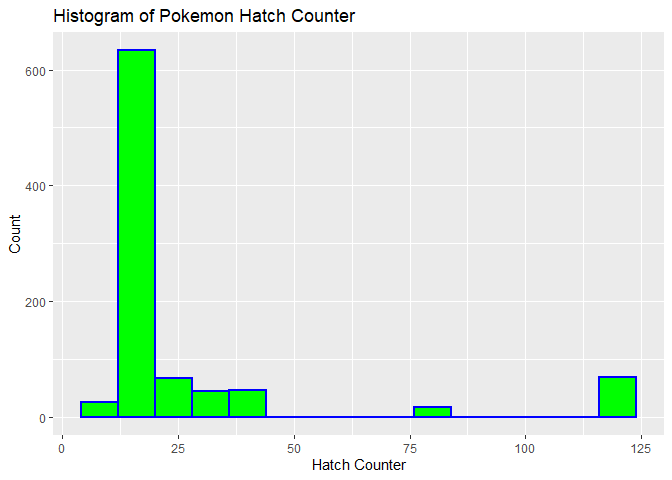
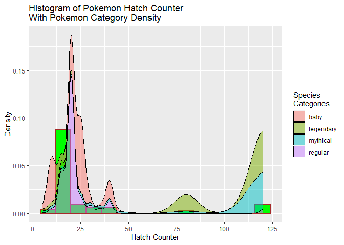

Pokemon API Vignette
================
Mark Austin
10/05/2021

-   [Introduction](#introduction)
-   [Required R Packages](#required-r-packages)
-   [Pokemon API Query and Data Proccessing
    Functions](#pokemon-api-query-and-data-proccessing-functions)
    -   [Pokemon Endpoint Functions](#pokemon-endpoint-functions)
    -   [Species Endpoint Functions](#species-endpoint-functions)
    -   [Evolution Chain Endpoint
        Functions](#evolution-chain-endpoint-functions)
    -   [Berries Endpoint Functions](#berries-endpoint-functions)
    -   [Forms Endpoint Functions](#forms-endpoint-functions)
-   [Exploratory Data Analysis](#exploratory-data-analysis)
    -   [Get Full Data Frames](#get-full-data-frames)
    -   [Creating New Variables](#creating-new-variables)
    -   [Contingency Tables](#contingency-tables)
    -   [Numerical Summaries](#numerical-summaries)
    -   [Bar Plot](#bar-plot)
    -   [Box Plot](#box-plot)
    -   [Histogram](#histogram)
    -   [Histogram Plus Density](#histogram-plus-density)
    -   [Scatter Plot One](#scatter-plot-one)
    -   [Scatter Plot Two](#scatter-plot-two)
    -   [Facet Wrapped Scatter Plot](#facet-wrapped-scatter-plot)

## Introduction

This is a vignette for reading and summarizing data from the [Pokemon
API](https://pokeapi.co/) using [Pokemon API
Documentation](https://pokeapi.co/docs/v2). After describing many API
query functions with accompanying R code, the vignette presents
exploratory data analysis again using R code.

## Required R Packages

The following R packages are required to run R code used in this
Vignette and/or create this document.

-   `tidyverse` The tidyverse package is used for data handling and
    plotting.

-   `jsonlite` The jsonlite package is used to contact the API and
    return data.

-   `knitr` The knitr package is used for document image handling.

-   `rmarkdown` The rmarkdown package is used by a render program to
    render this document.

## Pokemon API Query and Data Proccessing Functions

I created the following functions to query and process data from the
[Pokemon API](https://pokeapi.co/) using [Pokemon API
Documentation](https://pokeapi.co/docs/v2). I found that I could use
`fromJSON()` directly with the Pokemon API and directly assign API calls
to list of list objects.

For each endpoint, users can customize their query to return specific
data based on names or ids relevant to that endpoint. I provide metadata
functions so that users will know what names and ids are valid for a
given endpoint. I also tried different approaches to giving the user
flexibility in the data returned with some functions returning groups of
data and other letting the user do more customization.

### Pokemon Endpoint Functions

Most data relevant to individual pokemon is obtained from the [Pokemon
endpoint](https://pokeapi.co/docs/v2#pokemon). This endpoint returns a
complex list of lists with more data than most users would need. I’ve
provided three functions to query and process pokemon endpoint data. The
functions all return data frames.

1.  `getPokeNameIDFunction` In order to query individual pokemon, the
    user must provide either a name or id value. This function returns a
    list of all possible pokemon for this endpoint so that the user will
    know what pokemon are available. The names can be sorted as an
    option.

``` r
getPokeNameID <- function(sortName=FALSE){
  
  apiData<-fromJSON("https://pokeapi.co/api/v2/pokemon/?limit=1222")
  
  allNames<-as_tibble(apiData$results)
  
  allNames<-allNames %>% mutate(ID=as.numeric(basename(url)))
  
  if (sortName) {
    allNames<-allNames %>% arrange(name)
  }
  
  return(allNames)
  
}
```

Example `getPokeNameIDFunction` usage with output.

``` r
kable(head(getPokeNameID(sortName = TRUE)))
```

| name           | url                                        |    ID |
|:---------------|:-------------------------------------------|------:|
| abomasnow      | <https://pokeapi.co/api/v2/pokemon/460/>   |   460 |
| abomasnow-mega | <https://pokeapi.co/api/v2/pokemon/10060/> | 10060 |
| abra           | <https://pokeapi.co/api/v2/pokemon/63/>    |    63 |
| absol          | <https://pokeapi.co/api/v2/pokemon/359/>   |   359 |
| absol-mega     | <https://pokeapi.co/api/v2/pokemon/10057/> | 10057 |
| accelgor       | <https://pokeapi.co/api/v2/pokemon/617/>   |   617 |

2.  `getOnePokeData` Given a pokemon name or id, this function returns a
    data frame with data for that pokemon. Given how much data is
    available and the complexity of processing data, I give the user a
    few options for the amount of data returned. The default option
    returns top level data including
    `species,height,weight,base_experience`. Turning the basestat
    function option on additionally returns
    `hp,attack,defense,special_attack,special_defense ,speed`. Finally,
    turning the type option on additionally returns primary and
    secondary types `type_one,type_two`.

``` r
getOnePokeData<-function(pokemon,basestat=FALSE,type=FALSE){
  
  ##Get list of pokemon and process user pokemon input
  pokeNameID<-getPokeNameID()
  
  if (is.numeric(pokemon)){
    pokeNameID<-pokeNameID%>%filter(ID==pokemon)
  } else if (is.character(pokemon)){
    pokeNameID<-pokeNameID%>%filter(name==tolower(pokemon))
  } else {
    stop("Please enter either pokemon integer or quoated name value")
  }
  
  PokeList<- fromJSON(pokeNameID$url,flatten = TRUE)
  
  ###Function Default Data
  name<-PokeList$name
  height<-PokeList$height
  id<-PokeList$id
  species<-PokeList$species$name
  weight<-PokeList$weight
  base_experience<-PokeList$base_experience
  
  LocalDF<-data.frame(name,id,species,height,weight,base_experience)
  
  ##process and add base stat data if user selects basestat TRUE
  if (basestat){
    hp<-PokeList$stats$base_stat[1]
    attack<-PokeList$stats$base_stat[2]
    defense<-PokeList$stats$base_stat[3]
    special_attack<-PokeList$stats$base_stat[4]
    special_defense<-PokeList$stats$base_stat[5]
    speed<-PokeList$stats$base_stat[6]
    
    LocalDF<-LocalDF%>%mutate(hp,attack,defense,special_attack   ,special_defense ,speed)
  }
  
  ##process and add type data if user selects type TRUE
  if(type){
    ##All pokemon has at least one type so assign here
    type_one<-PokeList$types$type.name[1]
    
    ##check if more than one type and set 
    ##second type as needed
    if(length(PokeList$types$slot)>1){
      type_two<-PokeList$types$type.name[2]
    }else{
      type_two<-"None"
    }
    
    LocalDF<-LocalDF%>%mutate(type_one,type_two)
  }
  
  
  return(LocalDF)
  
}
```

Examples of ways to call `getOnePokeData`.

``` r
getOnePokeData("Venusaur")
getOnePokeData(pokemon=8,basestat = TRUE)
getOnePokeData(435,type = TRUE)
getOnePokeData(10032,basestat = TRUE,type = TRUE)
```

3.  `getEveryPokeData` This function returns data for ALL pokemon and
    returns one data frame. The amount of data returned is dependent on
    the basetat and type options as described in `getOnePokeData`.

``` r
getEveryPokeData<-function(basestat=FALSE,type=FALSE){
  
  ###Get current number of pokemon to process
  #getPokeNameID
  pokeNameID<-getPokeNameID()
  idVals<-pokeNameID$ID
  
  ###Loop through every pokemon and build data frame
  ###by adding new rows
  ###Most of the time spent here is in the numerous 
  ###   calls to API address since there are so many pokemon
  allPoke<-data.frame()
  for (i in idVals) {
    allPoke<-rbind(allPoke,getOnePokeData(i,basestat,type))
  }
  
  return(allPoke)
}
```

Example of `getEveryPokeData` data frame data.

``` r
everyPoke<-getEveryPokeData(basestat = TRUE,type = TRUE)
kable(head(everyPoke))
```

| name       |  id | species    | height | weight | base\_experience |  hp | attack | defense | special\_attack | special\_defense | speed | type\_one | type\_two |
|:-----------|----:|:-----------|-------:|-------:|-----------------:|----:|-------:|--------:|----------------:|-----------------:|------:|:----------|:----------|
| bulbasaur  |   1 | bulbasaur  |      7 |     69 |               64 |  45 |     49 |      49 |              65 |               65 |    45 | grass     | poison    |
| ivysaur    |   2 | ivysaur    |     10 |    130 |              142 |  60 |     62 |      63 |              80 |               80 |    60 | grass     | poison    |
| venusaur   |   3 | venusaur   |     20 |   1000 |              236 |  80 |     82 |      83 |             100 |              100 |    80 | grass     | poison    |
| charmander |   4 | charmander |      6 |     85 |               62 |  39 |     52 |      43 |              60 |               50 |    65 | fire      | None      |
| charmeleon |   5 | charmeleon |     11 |    190 |              142 |  58 |     64 |      58 |              80 |               65 |    80 | fire      | None      |
| charizard  |   6 | charizard  |     17 |    905 |              240 |  78 |     84 |      78 |             109 |               85 |   100 | fire      | flying    |

### Species Endpoint Functions

Most pokemon species map to one individual pokemon but there are some
species that map to several individual pokemon. Collective species data
is obtained from the [Pokemon Species
endpoint](https://pokeapi.co/docs/v2#pokemon-species). Because species
data is less complex, I was able to return more default data from this
endpoint than the pokemon endpoint. I’ve provided three functions to
query and process pokemon endpoint data. The functions all return data
frames.

1.  `getSpeciesNameID` This function returns a data frame with a list of
    possible species names and id values so that the user will know what
    is available. Optional sorting by name is provided.

``` r
getSpeciesNameID <- function(sortName=FALSE){
  
  apiData<-fromJSON("https://pokeapi.co/api/v2/pokemon-species/?limit=1222")
  
  allNames<-as_tibble(apiData$results)
  
  allNames<-allNames %>% mutate(ID=as.numeric(basename(url)))
  
  if (sortName) {
    allNames<-allNames %>% arrange(name)
  }
  
  return(allNames)
  
}
```

2.  `getOneSpeciesData` Given species name or id this function returns a
    data frame for one species with the following data.
    `species,shape,generation,base_happiness,capture_rate,gender_rate,hatch_counter,is_baby,is_legendary,is_mythical`.  
    Optionally, the user can select to return only the categorical data
    for this endpoint by turning on the onlyCat option.

``` r
getOneSpeciesData<-function(species,onlyCat=FALSE){
   
   ##Get list of species and process user species input
   pokeSpeciesID<-getSpeciesNameID()
   
   if (is.numeric(species)){
     pokeSpeciesID<-pokeSpeciesID%>%filter(ID==species)
   } else if (is.character(species)){
     pokeSpeciesID<-pokeSpeciesID%>%filter(name==tolower(species))
   } else {
     stop("Please enter either species integer or quoated name value")
   }
   
   PokeList<- fromJSON(pokeSpeciesID$url,flatten = TRUE)
   
   ###Function Data to return
   species<-PokeList$name
   shape<-PokeList$shape$name
   generation<-PokeList$generation$name
   base_happiness<-PokeList$base_happiness
   capture_rate<-PokeList$capture_rate
   gender_rate<-PokeList$gender_rate
   hatch_counter<-PokeList$hatch_counter
   is_baby<-PokeList$is_baby
   is_legendary<-PokeList$is_legendary
   is_mythical<-PokeList$is_mythical

   
   LocalDF<-data.frame(species,shape,generation,base_happiness,  
            capture_rate,gender_rate,hatch_counter,  
            is_baby,is_legendary,is_mythical)
   
   if(onlyCat){
     LocalDF<-LocalDF %>% select(-base_happiness,-capture_rate,
                        -gender_rate,-hatch_counter)
   }
   
   return(LocalDF)
   
 }
```

3.  `getEverySpeciesData` This function returns data for every species
    as a data frame with optional sorting of the data based on the
    sortName option. The following data is returned  
    `species,shape,generation,base_happiness,capture_rate,gender_rate,hatch_counter,is_baby,is_legendary,is_mythical`.  
    Optionally, the user can select to return only the categorical data
    for this endpoint by turning on the onlyCat option.

``` r
getEverySpeciesData<-function(sortName=FALSE,onlyCat=FALSE){
   
   ###Get current number of species to process
   pokeSpeciesID<-getSpeciesNameID()
   idVals<-pokeSpeciesID$ID
   
   
   ###Loop through every species and build data frame
   ###by adding new rows
   ###Most of the time spent here is in the numerous 
   ###   calls to API address since there are so many species
   allPoke<-data.frame()
   for (i in idVals) {
     allPoke<-rbind(allPoke,getOneSpeciesData(i,onlyCat))
   }
   
   if (sortName) {
     allPoke<-allPoke %>% arrange(species)
   }
   
   return(allPoke)
 }
```

Example of `getEverySpeciesData` data frame data.

``` r
everyPokeSpecies<-getEverySpeciesData(sortName = TRUE)
kable(head(everyPokeSpecies))
```

| species    | shape     | generation     | base\_happiness | capture\_rate | gender\_rate | hatch\_counter | is\_baby | is\_legendary | is\_mythical |
|:-----------|:----------|:---------------|----------------:|--------------:|-------------:|---------------:|:---------|:--------------|:-------------|
| abomasnow  | upright   | generation-iv  |              70 |            60 |            4 |             20 | FALSE    | FALSE         | FALSE        |
| abra       | upright   | generation-i   |              70 |           200 |            2 |             20 | FALSE    | FALSE         | FALSE        |
| absol      | quadruped | generation-iii |              35 |            30 |            4 |             25 | FALSE    | FALSE         | FALSE        |
| accelgor   | arms      | generation-v   |              70 |            75 |            4 |             15 | FALSE    | FALSE         | FALSE        |
| aegislash  | blob      | generation-vi  |              70 |            45 |            4 |             20 | FALSE    | FALSE         | FALSE        |
| aerodactyl | wings     | generation-i   |              70 |            45 |            1 |             35 | FALSE    | FALSE         | FALSE        |

### Evolution Chain Endpoint Functions

Many pokemon can [evolve](https://pokemondb.net/evolution) into another
more powerful pokemon. Evolution chain data is obtained from the
[Pokemon Evolution Chain
Endpoint](https://pokeapi.co/docs/v2#evolution-chains). This endpoint
only takes ID and those IDs are linked to one part of a chain.

I’ve provided three functions to query and process pokemon evolution
chain endpoint data. The functions both return data frames.

1.  `getOneEvolveData` This function takes an ID number for one of the
    chains and returns the chain data for that chain as data frame. Each
    data frame row has a value for a chain level or None if that chain
    does not have all three stages.

``` r
getOneEvolveData<-function(ID){
  
  ###Construct URL from the given ID and call API
  basicURL<-"https://pokeapi.co/api/v2/evolution-chain/"
  queryURL<-paste0(basicURL,ID)
  queryResult<-fromJSON(queryURL)
  
  ###Parse results into stages or no evolve categories
  stageOne<-queryResult$chain$species$name
  stageTwo<-queryResult[["chain"]][["evolves_to"]][["species"]][["name"]]
  stageThree<-queryResult[["chain"]][["evolves_to"]][["evolves_to"]][[1]][["species"]][["name"]] 
  if (is.null(stageTwo)){
    stageTwo<-"None"
  }
  if (is.null(stageThree)){
    stageThree<-"None"
  }
  
  localDF<-data.frame(stageOne,stageTwo,stageThree)
  return(localDF)
}
```

An example of data frame returned from `getOneEvolveData`

``` r
  kable(getOneEvolveData(57))
```

| stageOne | stageTwo | stageThree |
|:---------|:---------|:-----------|
| mime-jr  | mr-mime  | mr-rime    |

2.  `getAllEvolveSeries` This function returns a data frame of all the
    evolve stage items. The function will optionally sort on the first
    stage value.

``` r
getAllEvolveSeries<-function(sortName=FALSE){
  
  metaEvolve<-fromJSON("https://pokeapi.co/api/v2/evolution-chain/?limit=600")
  
  metaEvolveDF<-as_tibble(metaEvolve$results)
  
  metaEvolveDF<-metaEvolveDF %>% mutate(ID=as.numeric(basename(url)))
  
  ##Loop through all the ID values and build a data frame
  ## for all the evolution chain data
  allEvolve<-data.frame()
  for (loopID in metaEvolveDF$ID) {
    allEvolve<-rbind(allEvolve,getOneEvolveData(loopID))
  } 
  
   if (sortName) {
     allEvolve<-allEvolve %>% arrange(stageOne)
   }
  
  return(allEvolve)
}
```

3.  `getAllEvolveStages` This function takes data parsed by chain and
    converts the data into a data frame containing species name and
    stage value for that species. The function will optionally sort on
    species.

``` r
getAllEvolveStages<-function(sortName=FALSE){
  
  resultsEvolve<-getAllEvolveSeries()
  
  ###Handles the first one which they all have
  ###Now can do stageTwo and three
  allEvolve<-data.frame()
  species<-resultsEvolve$stageOne
  stages<-ifelse(resultsEvolve$stageTwo=="None",stage<-"noEvolve",stage<-"one")
  stages
  allEvolve<-data.frame(species,stages)
  ###Need to use rbind to add other parts after this part
  species<-resultsEvolve$stageTwo
  stages<-ifelse(resultsEvolve$stageTwo=="None",stage<-"noEvolve",stage<-"two")
  twoEvolve<-data.frame(species,stages)
  twoEvolve<-twoEvolve %>% filter(species!="None")
  allEvolve<-rbind(allEvolve,twoEvolve)
  
  species<-resultsEvolve$stageThree
  stages<-ifelse(resultsEvolve$stageThree=="None",stage<-"noEvolve",stage<-"three")
  threeEvolve<-data.frame(species,stages)
  threeEvolve<-threeEvolve %>% filter(species!="None")
  allEvolve<-rbind(allEvolve,threeEvolve)
  ###Later use distinct function to remove duplicate rows
  allEvolve<-allEvolve %>% distinct(species,.keep_all = TRUE)
  
  allEvolve$stages<-as.factor(allEvolve$stages)
  allEvolve$stages<-ordered(allEvolve$stages,levels=c("one","two","three","noEvolve"))
  
  if (sortName) {
     allEvolve<-allEvolve %>% arrange(species)
   }
  
  return(allEvolve)
}
```

An example of output from `getAllEvolveStages`.

``` r
  evolveStages<-getAllEvolveStages(sortName = TRUE)
  kable(head(evolveStages))
```

| species    | stages   |
|:-----------|:---------|
| abomasnow  | two      |
| abra       | one      |
| absol      | noEvolve |
| accelgor   | two      |
| aegislash  | three    |
| aerodactyl | noEvolve |

### Berries Endpoint Functions

[Berries](https://pokeapi.co/docs/v2#berries-section) can provide
various benefits to pokemon when they eat berries.

I’ve provided three functions to query and process berries data. The
functions all return data frames.

1.  `getBerryNameID` This function returns a data frame with a list of
    possible berry names and id values so that the user will know what
    is available. Optional sorting by name is provided.

``` r
getBerryNameID <- function(sortName=FALSE){
  
  apiData<-fromJSON("https://pokeapi.co/api/v2/berry/?limit=1222")
  
  allNames<-as_tibble(apiData$results)
  
  allNames<-allNames %>% mutate(ID=as.numeric(basename(url)))
  
  if (sortName) {
    allNames<-allNames %>% arrange(name)
  }
  
  return(allNames)
  
}
```

2.  `getOneBerryData` Given berry name or id this function returns a
    data frame for one berry.

The user must select the variables returned by providing a character
vector with variable names from this set.  
`name`,`growth_time`,`max_harvest`,`natural_gift_power`,
`size`,`smoothness`,`soil_drynes`  
To select all variables, only assign “full” to the vector.

``` r
getOneBerryData<-function(berry,variables){
  
  ##Get list of berries and process user berry input
  pokeBerryID<-getBerryNameID()
  
  if (is.numeric(berry)){
    pokeBerryID<-pokeBerryID%>%filter(ID==berry)
  } else if (is.character(species)){
    pokeBerryID<-pokeBerryID%>%filter(name==tolower(berry))
  } else {
    stop("Please enter either species integer or quoated name value")
  }
  
  BerryList<- fromJSON(pokeBerryID$url,flatten = TRUE)
  
  ###Function Data to return
  name<-BerryList$name
  growth_time<-BerryList$growth_time
  max_harvest<-BerryList$max_harvest
  natural_gift_power<-BerryList$natural_gift_power
  size<-BerryList$size
  smoothness<-BerryList$smoothness
  soil_drynes<-BerryList$soil_dryness
  
  
  
  LocalDF<-data.frame(name,growth_time,max_harvest,natural_gift_power,
                      size,smoothness,soil_drynes)
  
   if (variables[1]!="full"){
      LocalDF<-LocalDF%>%select(all_of(variables))
   }
  
  return(LocalDF)
  
}
```

Examples of `getOneBerryData` usage with output.

``` r
kable(getOneBerryData(34,"full"))  
```

| name  | growth\_time | max\_harvest | natural\_gift\_power | size | smoothness | soil\_drynes |
|:------|-------------:|-------------:|---------------------:|-----:|-----------:|-------------:|
| durin |           15 |           15 |                   80 |  280 |         35 |            8 |

``` r
kable(getOneBerryData(22,c("name","size","smoothness")))
```

| name   | size | smoothness |
|:-------|-----:|-----------:|
| kelpsy |  150 |         20 |

3.  `getEveryBerryData` This function returns data for every name as a
    data frame with optional sorting of the data based on the sortName
    option.

The user must select the variables returned by providing a character
vector with variable names from this set.  
`name`,`growth_time`,`max_harvest`,`natural_gift_power`,
`size`,`smoothness`,`soil_drynes`  
To select all variables, only assign “full” to the vector.

``` r
getEveryBerryData<-function(sortName=FALSE,variables){
  
  ###Get current number of berries to process
  pokeBerryID<-getBerryNameID()
  idVals<-pokeBerryID$ID
  
  ###Loop through every berry and build data frame
  ###by adding new rows
  ###Most of the time spent here is in the numerous 
  ###   calls to API address since there are so many species
  allBerry<-data.frame()
  for (i in idVals) {
    allBerry<-rbind(allBerry,getOneBerryData(i,variables))
  }
  
  if (sortName) {
    allBerry<-allBerry %>% arrange(name)
  }
  
  return(allBerry)
}
```

An example of `getEveryBerryData` usage to return all data sorted by
berry name.

``` r
kable(head(getEveryBerryData(sortName = TRUE,"full")))
```

| name   | growth\_time | max\_harvest | natural\_gift\_power | size | smoothness | soil\_drynes |
|:-------|-------------:|-------------:|---------------------:|-----:|-----------:|-------------:|
| aguav  |            5 |            5 |                   60 |   64 |         25 |           10 |
| apicot |           24 |            5 |                   80 |   75 |         40 |            4 |
| aspear |            3 |            5 |                   60 |   50 |         25 |           15 |
| babiri |           18 |            5 |                   60 |  265 |         35 |            6 |
| belue  |           15 |           15 |                   80 |  300 |         35 |            8 |
| bluk   |            2 |           10 |                   70 |  108 |         20 |           35 |

### Forms Endpoint Functions

[Pokemon Forms](https://pokeapi.co/docs/v2#pokemon-forms) are ways
different pokemon might appear visually and can differ in different
situations like battle.

I’ve provided three functions to query and process forms data. The
functions all return data frames.

1.  `getFormNameID` This function returns a data frame with a list of
    possible names and id values so that the user will know what is
    available. Optional sorting by name is provided.

``` r
getFormNameID <- function(sortName=FALSE){
  
  apiData<-fromJSON("https://pokeapi.co/api/v2/pokemon-form/?limit=1300")
  
  allNames<-as_tibble(apiData$results)
  
  allNames<-allNames %>% mutate(ID=as.numeric(basename(url)))
  
  if (sortName) {
    allNames<-allNames %>% arrange(name)
  }
  
  return(allNames)
  
}
```

2.  `getOneFormData` Given pokemon name or id this function returns a
    data frame for one species form. Be aware that many pokemon were not
    assigned a form by the pokemon API and those pokemon forms return
    "".

The user must select the variables returned by providing a character
vector with variable names from this set.  
`name`,`form_name`,`is_battle_only`,`is_default`,`is_mega`,`version_group`

To select all variables, only assign “full” to the vector.

``` r
getOneFormData<-function(form,variables){
  
  ##Get list of forms and process user species input
  pokeFormID<-getFormNameID()
  
  if (is.numeric(form)){
    pokeFormID<-pokeFormID%>%filter(ID==form)
  } else if (is.character(species)){
    pokeFormID<-pokeFormID%>%filter(name==tolower(form))
  } else {
    stop("Please enter either species integer or quoated name value")
  }
  
  FormList<- fromJSON(pokeFormID$url,flatten = TRUE)
  
  ###Function Data to return
  name<-FormList$name
  form_name<-FormList$form_name
  is_battle_only<-FormList$is_battle_only
  is_default<-FormList$is_default
  is_mega<-FormList$is_mega
  version_group<-FormList$version_group$name
  
  LocalDF<-data.frame(name,form_name,is_battle_only,is_default,is_mega,version_group)
  
  if (variables[1]!="full"){
    LocalDF<-LocalDF%>%select(all_of(variables))
  }
  
  return(LocalDF)
  
}
```

``` r
kable(getOneFormData(413,"full"))
```

| name           | form\_name | is\_battle\_only | is\_default | is\_mega | version\_group |
|:---------------|:-----------|:-----------------|:------------|:---------|:---------------|
| wormadam-plant | plant      | FALSE            | TRUE        | FALSE    | diamond-pearl  |

3.  `getEveryFormData` This function returns data for every berry as a
    data frame with optional sorting of the data based on the sortName
    option.

The user must select the variables returned by providing a character
vector with variable names from this set.  
`name`,`form_name`,`is_battle_only`,`is_default`,`is_mega`,`version_group`

To select all variables, only assign “full” to the vector.

``` r
getEveryFormData<-function(sortName=FALSE,variables){
  
  ###Get current number of forms to process
  pokeFormID<-getFormNameID()
  idVals<-pokeFormID$ID
  
  ###Loop through every form and build data frame
  ###by adding new rows
  ###Most of the time spent here is in the numerous 
  ###   calls to API address since there are so many species
  allForm<-data.frame()
  for (i in idVals) {
    allForm<-rbind(allForm,getOneFormData(i,variables))
  }
  
  if (sortName) {
    allForm<-allForm %>% arrange(name)
  }
  
  return(allForm)
}
```

<br>

## Exploratory Data Analysis

### Get Full Data Frames

I started by pulling data from the first three endpoints I wrote
functions for earlier. I found that those three endpoints had enough
relevant data for all the required analysis. I pull all the data here so
that I’ll have it stored in objects for later use.

``` r
###Get all the data needed for data exploration
allPoke<-getEveryPokeData(basestat = TRUE,type = TRUE)
allSpecies<-getEverySpeciesData()
allStages<-getAllEvolveStages()
```

### Creating New Variables

In this section I create new variables that I plan to use in later
analysis.  
First, I create a `totalPts` quantitative variable based on adding
related point based variables. In pokemon references different pokemon
are often compared based on total points. Here is a reference showing
total poins for one particular pokemon [Total Point
Example](https://bulbapedia.bulbagarden.net/wiki/Kricketot_(Pok%C3%A9mon)#Base_stats)

Second, I create a `hgtwgt_ratio` quantitative variable based on the
basic height to weight ratio. This ratio is often used in biology.

Third, I create a `common` categorical variable based on other species
categorical variables. I wanted every species to be in one `common`
category that eventually will show whether the species is in one of the
rare categories like legendary or mythical.

Fourth, I create a related `rare` categorical variable that assigns each
species to either rare of regular status.

``` r
###total points
moreAllPoke<-allPoke %>% 
  mutate(totalPts=(hp+attack+defense+special_attack +special_defense
  +speed)) %>% 
  select(name,id,species,height,weight,base_experience,totalPts,everything())

###height to weight ratio
moreAllPoke<-moreAllPoke %>%mutate(hgtwgt_ratio=height/weight)

###mythic,legendary, regular,baby
###Create new common variable that assigns one of these values
moreAllSpecies<-allSpecies %>% 
  mutate(common=if_else(is_baby, "baby",
              if_else(is_mythical,"mythical",
                    if_else(is_legendary,"legendary","regular"))))

###Create new rare variable to more broadly categorize rare and regular 
moreAllSpecies<-moreAllSpecies %>% 
  mutate(rare=if_else(is_baby |is_mythical |is_legendary, "rare",
                      "regular")) 
```

### Contingency Tables

**Contingency Table One**

Every individual pokemon has one of 18 different [pokemon
types](https://bulbapedia.bulbagarden.net/wiki/Type). I created my first
contingency table to examine how many pokemon were part of each type by
the evolution stage for that pokemon. I included non evolving pokemon
because many pokemon do not evolve. I added margin sums to help spot
trends between categories.

``` r
###combine needed tables to get data together for table
combinePoke<-inner_join(moreAllPoke,allStages,by="species") %>% select(name,stages,everything())

###Create table then add margins to include sums
tOne<-table(combinePoke$type_one,combinePoke$stages )
kable(addmargins(tOne),caption = "Contingency Table of Type by Stage")
```

|          | one | two | three | noEvolve |  Sum |
|:---------|----:|----:|------:|---------:|-----:|
| bug      |  27 |  34 |    12 |       11 |   84 |
| dark     |  16 |  19 |     4 |        9 |   48 |
| dragon   |   7 |   9 |    10 |       17 |   43 |
| electric |  12 |  31 |     8 |       26 |   77 |
| fairy    |   7 |  10 |     3 |        4 |   24 |
| fighting |  13 |  20 |     3 |        9 |   45 |
| fire     |  18 |  25 |    15 |       11 |   69 |
| flying   |   2 |   2 |     2 |        3 |    9 |
| ghost    |  15 |  16 |     5 |       10 |   46 |
| grass    |  31 |  38 |    19 |        8 |   96 |
| ground   |  16 |  17 |     3 |        6 |   42 |
| ice      |  11 |  16 |     4 |        8 |   39 |
| normal   |  43 |  39 |    11 |       25 |  118 |
| poison   |  16 |  21 |     3 |        3 |   43 |
| psychic  |  18 |  19 |    12 |       31 |   80 |
| rock     |  20 |  20 |     7 |       26 |   73 |
| steel    |   8 |  12 |     7 |       13 |   40 |
| water    |  45 |  54 |    20 |       22 |  141 |
| Sum      | 325 | 402 |   148 |      242 | 1117 |

Contingency Table of Type by Stage

What stood out to me from the first table in regard to evolution stages
was that there were many more first and second stage pokemon than third
stage. That outcome made sense because players go from lower to higher
stages over time so fewer third stage were expected.  
As for pokemon types, I immediately notice there are very few flying
types. I also noticed water, normal, and grass were most numerous. The
other trend I saw was that each type tends to follow the overall pattern
of more first and second stage pokemon.

**Contingency Table Two**

I learned [pokemon
generations](https://bulbapedia.bulbagarden.net/wiki/Generation) are
used to group pokemon over time with i being oldest and viii being most
recent. For the second table, I looked at generation versus what I
called common status meaning whether a pokemon is regular or in rare
category. I added margin sums again to help spot patterns. Note this
data is from species data and there are fewer species than pokemon.

``` r
#Create table for generation and common categories
tTwo<-table(moreAllSpecies$generation,moreAllSpecies$common)
kable(addmargins(tTwo),
      caption = "Contingency Table of Generation by Common Status")
```

|                 | baby | legendary | mythical | regular | Sum |
|:----------------|-----:|----------:|---------:|--------:|----:|
| generation-i    |    0 |         4 |        1 |     146 | 151 |
| generation-ii   |    8 |         5 |        1 |      86 | 100 |
| generation-iii  |    2 |         8 |        2 |     123 | 135 |
| generation-iv   |    8 |         9 |        5 |      85 | 107 |
| generation-v    |    0 |         9 |        4 |     143 | 156 |
| generation-vi   |    0 |         3 |        3 |      66 |  72 |
| generation-vii  |    0 |         9 |        5 |      74 |  88 |
| generation-viii |    0 |        10 |        1 |      78 |  89 |
| Sum             |   18 |        57 |       22 |     801 | 898 |

Contingency Table of Generation by Common Status

<br>  
What stood out to me in the second table was there were more pokemon
species created in the i to V earlier generations than the more recent
generations. In addition, I did confirm that the rare types are indeed
rare with baby being especially uncommon.

### Numerical Summaries

**Capture Rate By Generation**  
I learned that [capture
rate](https://bulbapedia.bulbagarden.net/wiki/Catch_rate) is a key value
where higher numbers mean easier to catch. I summarized by generation to
see whether capture rate was changing over time.

``` r
allSpecies %>% group_by(generation) %>% 
  summarise(Avg = mean(capture_rate), Sd = sd(capture_rate), 
    Median = median(capture_rate), IQR =IQR(capture_rate)) %>% kable()
```

| generation      |       Avg |       Sd | Median |   IQR |
|:----------------|----------:|---------:|-------:|------:|
| generation-i    | 106.18543 | 77.10654 |   75.0 | 145.0 |
| generation-ii   |  91.90000 | 71.67611 |   60.0 |  75.0 |
| generation-iii  | 113.35556 | 83.82003 |   90.0 | 145.0 |
| generation-iv   |  78.85981 | 69.46174 |   45.0 |  75.0 |
| generation-v    | 103.10256 | 76.61131 |   75.0 | 145.0 |
| generation-vi   | 100.40278 | 72.47664 |   62.5 | 120.0 |
| generation-vii  |  77.72727 | 67.96918 |   45.0 |  47.5 |
| generation-viii |  97.28090 | 82.43262 |   60.0 |  82.0 |

I did not spot a clear pattern over time in the capture rates. I did
notice the IQR varied a lot from year to year meaning variability of
capture rate did change a lot over time but in no clear pattern.

**Height to Weight Ration by Common Status**

I next looked at height to weight ratio by the common categories.

``` r
#using hgtwgt_ratio
comboSpeciesPoke<-inner_join(moreAllPoke,moreAllSpecies,by="species")
comboSpeciesPoke %>% group_by(common)  %>% 
  summarise(Avg = mean(hgtwgt_ratio), Sd = sd(hgtwgt_ratio), 
      Median =  median(hgtwgt_ratio), IQR =IQR(hgtwgt_ratio)) %>% kable() 
```

| common    |       Avg |        Sd |    Median |       IQR |
|:----------|----------:|----------:|----------:|----------:|
| baby      | 0.0950516 | 0.0979774 | 0.0445055 | 0.1046340 |
| legendary | 0.0800844 | 0.2755390 | 0.0181102 | 0.0232564 |
| mythical  | 0.0589330 | 0.0606246 | 0.0292845 | 0.0673077 |
| regular   | 0.1145914 | 0.6820708 | 0.0368272 | 0.0450000 |

From this summary, I noticed the regular category had the highest
average but the regular median was not too different from mythical. I’d
really hoped to see more with this particular summary.

**Total Points by Common Status**

For my third numerical summary, I looked at total points by common
types.

``` r
comboSpeciesPoke %>% group_by(common) %>% 
    summarise(Avg = mean(totalPts), Sd = sd(totalPts), Median =       
              median(totalPts), IQR =IQR(totalPts)) %>% kable()
```

| common    |      Avg |        Sd | Median |    IQR |
|:----------|---------:|----------:|-------:|-------:|
| baby      | 276.2778 |  61.34263 |  282.5 |  90.25 |
| legendary | 627.3333 | 103.11584 |  600.0 | 100.00 |
| mythical  | 595.0000 |  66.04007 |  600.0 |   0.00 |
| regular   | 422.1835 | 102.83936 |  440.0 | 175.00 |

As expected the legendary and mythical types have much higher total
points(a measure of power) than the other types with baby having the
least points.

### Bar Plot

I was curious to learn more about the pokemon species that do not
evolve. I first needed to join data so I’d have what I needed together
for a bar plot.

``` r
###combine data frames to give access to rare and species data
###Then create bar plot of this data.  
combineSpeciesStage<-inner_join(moreAllSpecies,allStages,by="species")


g <- ggplot(combineSpeciesStage, aes(x = stages))
g + geom_bar(aes(fill=(rare)),position = "dodge") +
  scale_fill_discrete(name="Species\nCategories") + 
  labs(x="Evolution Stages", y="Count",
  title = "Bar Plot of Evolution Stages for Rare and Regular Species")
```

<!-- -->

The bar plot gave me new insight about non evolving pokemon species. The
plots shows many of the non evolving species are one of the rare groups
like mythical or legendary. It made sense to me that rare species would
not evole or otherwise they would not be so uncommon.

### Box Plot

I was interested in investigating the relationship between pokemon total
points and evolution stage in a box plot. I needed to manually adjust
the colors because the automatic colors were blending into the
background.

``` r
###Create a boxplot with added points for stage and total points  
g <- ggplot(combinePoke, aes(x = stages, y = totalPts))
g + geom_boxplot(fill="green1") + 
  geom_point((aes(color = stages)), size=1,position = "jitter",alpha = 0.1) +
  labs(x="Evolution Stages", y="Total Points",
  title = "Boxplot of Total Points for Different Evolution Stages") + 
  scale_color_manual(values = c("red", "blue", "orangered","purple"),name ="Evolution\nStages") 
```

<!-- --> <br>  
The boxplot confirmed my expectation that total points would be higher
for higher pokemon evolution stages. This outcome makes sense because
more evolved pokemon are more powerful and power is quantified by total
points. In addition, I could see that the no evolving pokemon are also
mainly very powerful too and have a lot of variability.

### Histogram

I learned that the pokemon hatch counter variable determines how long it
takes for pokemon eggs to hatch. Per the doc, “Initial hatch counter:
one must walk 255 × (hatch\_counter + 1) steps before this Pokemon’s egg
hatches, unless utilizing bonuses like Flame Body’s.” I wanted to get an
graph of the distribution of hatch count by creating a histogram.

``` r
###creating histogram of hatch_counter data 
g <- ggplot(moreAllSpecies, aes( x = hatch_counter))
g + geom_histogram(binwidth=8,color = "brown", fill = "green", 
  size = 1)  + labs(x="Hatch Counter", y="Count",
  title = "Histogram of Pokemon Hatch Counter") 
```

<!-- -->

The histogram of hatch counter appears to be right skewed with most
hatch counter values being smaller but a smaller number being larger
values.

### Histogram Plus Density

After I completed the histogram, I was curious what might explain the
higher hatch counter values being so infrequent? To address this
question, I created a density overlay by type of pokemon.

``` r
###creating histogram of hatch_counter data plus density 
g <- ggplot(moreAllSpecies, aes(y=..density.., x = hatch_counter))
g + geom_histogram(binwidth=8,color = "brown", fill = "green", 
    size = 1)  + labs(x="Hatch Counter", y="Density", title = 
      "Histogram of Pokemon Hatch Counter\nWith Pokemon Category Density",
       fill="Species\nCategories") + 
  geom_density(adjust = 0.5, alpha = 0.5, aes(fill = common), 
    position = "stack")
```

<!-- -->

Adding the density plots did help explain the larger hatch counter
values. The density plots show that the larger hatch counter values go
with the rare legendary and mythical pokemon. Part of being rare would
be that those types would not hatch as often as other types.

### Scatter Plot One

Base experience is the number of experience points awarded when a
pokemon is defeated. I created a scatter plot of total points (a measure
of total power) and base experience to see whether players are rewarded
in propoption to the power of a pokemon opponent.

``` r
#Setup for a scatter plot of base_experience and total points
corExpPts<-cor(comboSpeciesPoke$base_experience,comboSpeciesPoke$totalPts)

g<-ggplot(data = comboSpeciesPoke,aes(x=totalPts,y=base_experience))
g+geom_point(aes(color=rare)) + 
  geom_smooth(method = lm) +
  geom_text(x=350,y=500,size=5,
        label = paste0("Correlation = ",round(corExpPts, 2))) +
  labs(x="Total Points", y="Base Experience",
       title = "Scatter Plot of Pokemon Base Exerience Versus Total Points",
       color="Species\nCategories")
```

<!-- -->

Although I was not surprised to see a linear relationship, I was
surprised to see just how strong the postie correlation was between
these variables. This did confirm players are rewarded based in
proportion to total power. The other interesting trend in this graph was
how there are four almost straight lines with very similar slopes.

### Scatter Plot Two

Next I wanted to do a scatter plot for variables that I suspected to
have a negative correlation. The capture rate variable measures how hard
or easy it is to capture a pokemon with lower values being harder and
higher values being easier to catch. I created a scatter plot of total
points (a measure of total power) and and capture rate to see whether
these would be negatively correlated as I expected.

``` r
#Setup for a scatter plot of  total points and capture_rate
corrCapPts<-cor(comboSpeciesPoke$capture_rate,comboSpeciesPoke$totalPts)

g<-ggplot(data = comboSpeciesPoke,aes(x=capture_rate,y=totalPts))
g+geom_point(aes(color=common))  + 
  geom_smooth(method = lm) +
  geom_text(x=50,y=950,size=5,
      label = paste0("Correlation = ",round(corrCapPts, 2))) +
  labs(x="Capture Rate",y="Total Points",color='Species\nCategories',
      title = "Scatter Plot of Pokemon Total Points Versus Capture Rate ") 
```

<!-- -->

From the scatter plot, I did confirm these variables are moderately
negatively correlated as I expected. It made sense that more power
(higher points) pokemon would be harder to capture (lower capture
rates). This trend was specially true for the more common regular
pokemon group.

### Facet Wrapped Scatter Plot

From the previous scatter plot, I was curious what the scatter plot
would show if it were separately drawn for each category. I created a
facet wrap version to examine this question.

``` r
##
g<-ggplot(data = comboSpeciesPoke,aes(x=capture_rate,y=totalPts))
g+geom_point() + facet_wrap(~common) + 
  labs(x="Capture Rate",y="Total Points",
    color='Species\nCategories',
    title = "Facet Wrapped\nScatter Plots of Pokemon Total Points Versus Capture Rate ") 
```

<!-- -->

The first part of the facet wrap graph that stood out to me is that the
regular type most clearly shows the negative correlation. The second
part that stood out to me is that the legendary type might actually be
positively correlated or not be very correlated at all. The other types
did not show clear patterns.
