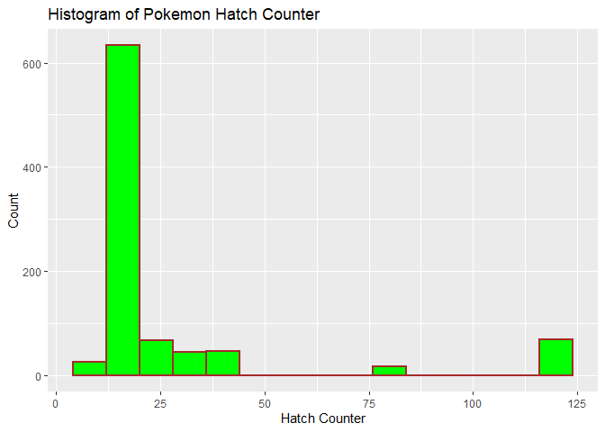

Pokemon API Vignette
================
Mark Austin
10/05/2021

-   [Required R Packages](#required-r-packages)
-   [Pokemon API Query and Data Proccessing
    Functions](#pokemon-api-query-and-data-proccessing-functions)
    -   [Pokemon Endpoint Functions.](#pokemon-endpoint-functions)
    -   [Species Endpoint Functions](#species-endpoint-functions)
    -   [Evolution Chain Endpoint
        Functions.](#evolution-chain-endpoint-functions)
-   [Exploratory Data Analysis](#exploratory-data-analysis)
    -   [Get Full Data Frames](#get-full-data-frames)
    -   [Creating New Variables](#creating-new-variables)
    -   [Contingency Tables](#contingency-tables)
    -   [Numerical Summaries](#numerical-summaries)
    -   [Box Plot](#box-plot)
    -   [Bar Plot](#bar-plot)
    -   [Histogram](#histogram)
    -   [Scatter Plot](#scatter-plot)
    -   [Facet Scatter Plot](#facet-scatter-plot)

## Required R Packages

The following R packages are required to run R code used in this
Vignette and/or create this document.

-   `tidyverse` The tidyverse package is used for data handling and
    plotting.

-   `jsonlite` The jsonlite package is used to contact the API and
    return data.

-   `knitr` The knitr package is used for document image handling.

-   `rmarkdown` The rmarkdown package is used by a render program to
    render this document.

## Pokemon API Query and Data Proccessing Functions

I created the following functions to query and process data from the
[Pokemon API](https://pokeapi.co/) using [Pokemon API
Documentation](https://pokeapi.co/docs/v2). I found that I could use
`fromJSON()` directly with the Pokemon API and directly assign API
calls.

### Pokemon Endpoint Functions.

Most data relevant to individual pokemon is obtained from the [Pokemon
endpoint](https://pokeapi.co/docs/v2#pokemon). This endpoint returns a
complex list of lists with more data than most users would need. I’ve
provided three functions to query and process pokemon endpoint data. The
functions all return data frames.

1.  `getPokeNameIDFunction` In order to query individual pokemon, the
    user must provide either a name or id value. This function returns a
    list of all possible pokemon for this endpoint so that the user will
    know what pokemon are available. The names can be sorted as an
    option.

``` r
getPokeNameID <- function(sortName=FALSE){
  
  apiData<-fromJSON("https://pokeapi.co/api/v2/pokemon/?limit=1222")
  
  allNames<-as_tibble(apiData$results)
  
  allNames<-allNames %>% mutate(ID=as.numeric(basename(url)))
  
  if (sortName) {
    allNames<-allNames %>% arrange(name)
  }
  
  return(allNames)
  
}
```

Example `getPokeNameIDFunction` usage with output.

``` r
head(getPokeNameID(sortName = TRUE))
```

<div class="kable-table">

| name           | url                                        |    ID |
|:---------------|:-------------------------------------------|------:|
| abomasnow      | <https://pokeapi.co/api/v2/pokemon/460/>   |   460 |
| abomasnow-mega | <https://pokeapi.co/api/v2/pokemon/10060/> | 10060 |
| abra           | <https://pokeapi.co/api/v2/pokemon/63/>    |    63 |
| absol          | <https://pokeapi.co/api/v2/pokemon/359/>   |   359 |
| absol-mega     | <https://pokeapi.co/api/v2/pokemon/10057/> | 10057 |
| accelgor       | <https://pokeapi.co/api/v2/pokemon/617/>   |   617 |

</div>

2.  `getOnePokeData` Given a pokemon name or id, this function returns a
    data frame with data for that pokemon. Given how much data is
    available and the complexity of processing data, I give the user a
    few options for the amount of data returned. The default option
    returns top level data including
    `species,height,weight,base_experience`. Turning the basestat
    function additionally returns
    `hp,attack,defense,special_attack,special_defense ,speed`. Finally,
    turning the type option on additionally returns primary and
    secondary types `type_one,type_two`.

``` r
getOnePokeData<-function(pokemon,basestat=FALSE,type=FALSE){
  
  ##Get list of pokemon and process user pokemon input
  pokeNameID<-getPokeNameID()
  
  if (is.numeric(pokemon)){
    pokeNameID<-pokeNameID%>%filter(ID==pokemon)
  } else if (is.character(pokemon)){
    pokeNameID<-pokeNameID%>%filter(name==tolower(pokemon))
  } else {
    stop("Please enter either pokemon integer or quoated name value")
  }
  
  PokeList<- fromJSON(pokeNameID$url,flatten = TRUE)
  
  ###Function Default Data
  name<-PokeList$name
  height<-PokeList$height
  id<-PokeList$id
  species<-PokeList$species$name
  weight<-PokeList$weight
  base_experience<-PokeList$base_experience
  
  LocalDF<-data.frame(name,id,species,height,weight,base_experience)
  
  ##process and add base stat data if user selects basestat TRUE
  if (basestat){
    hp<-PokeList$stats$base_stat[1]
    attack<-PokeList$stats$base_stat[2]
    defense<-PokeList$stats$base_stat[3]
    special_attack<-PokeList$stats$base_stat[4]
    special_defense<-PokeList$stats$base_stat[5]
    speed<-PokeList$stats$base_stat[6]
    
    LocalDF<-LocalDF%>%mutate(hp,attack,defense,special_attack   ,special_defense ,speed)
  }
  
  ##process and add type data if user selects type TRUE
  if(type){
    ##All pokemon has at least one type so assign here
    type_one<-PokeList$types$type.name[1]
    
    ##check if more than one type and set 
    ##second type as needed
    if(length(PokeList$types$slot)>1){
      type_two<-PokeList$types$type.name[2]
    }else{
      type_two<-"None"
    }
    
    LocalDF<-LocalDF%>%mutate(type_one,type_two)
  }
  
  
  return(LocalDF)
  
}
```

Examples of ways to use `getOnePokeData`.

``` r
getOnePokeData("Venusaur")
getOnePokeData(pokemon=8,basestat = TRUE)
getOnePokeData(435,type = TRUE)
getOnePokeData(10032,basestat = TRUE,type = TRUE)
```

3.  `getEveryPokeData` This function returns data for ALL pokemon and
    returns one data frame. The amount of data returned is dependent on
    the basetat and type options as described in `getOnePokeData`.

``` r
getEveryPokeData<-function(basestat=FALSE,type=FALSE){
  
  ###Get current number of pokemon to process
  #getPokeNameID
  pokeNameID<-getPokeNameID()
  idVals<-pokeNameID$ID
  
  ###Loop through every pokemon and build data frame
  ###by adding new rows
  ###Most of the time spent here is in the numerous 
  ###   calls to API address since there are so many pokemon
  allPoke<-data.frame()
  for (i in idVals) {
    allPoke<-rbind(allPoke,getOnePokeData(i,basestat,type))
  }
  
  return(allPoke)
}
```

Example of `getEveryPokeData` data frame data.

``` r
everyPoke<-getEveryPokeData(basestat = TRUE,type = TRUE)
head(everyPoke)
```

<div class="kable-table">

| name       |  id | species    | height | weight | base\_experience |  hp | attack | defense | special\_attack | special\_defense | speed | type\_one | type\_two |
|:-----------|----:|:-----------|-------:|-------:|-----------------:|----:|-------:|--------:|----------------:|-----------------:|------:|:----------|:----------|
| bulbasaur  |   1 | bulbasaur  |      7 |     69 |               64 |  45 |     49 |      49 |              65 |               65 |    45 | grass     | poison    |
| ivysaur    |   2 | ivysaur    |     10 |    130 |              142 |  60 |     62 |      63 |              80 |               80 |    60 | grass     | poison    |
| venusaur   |   3 | venusaur   |     20 |   1000 |              236 |  80 |     82 |      83 |             100 |              100 |    80 | grass     | poison    |
| charmander |   4 | charmander |      6 |     85 |               62 |  39 |     52 |      43 |              60 |               50 |    65 | fire      | None      |
| charmeleon |   5 | charmeleon |     11 |    190 |              142 |  58 |     64 |      58 |              80 |               65 |    80 | fire      | None      |
| charizard  |   6 | charizard  |     17 |    905 |              240 |  78 |     84 |      78 |             109 |               85 |   100 | fire      | flying    |

</div>

### Species Endpoint Functions

Most pokemon species map to one individual pokemon but there are some
species that map to several indidual pokemon. Collective species data is
obtained from the [Pokemon Species
endpoint](https://pokeapi.co/docs/v2#pokemon-species). Because species
data is less complex, I was able to return more default data from this
endpoint than the pokemon endpoint. I’ve provided three functions to
query and process pokemon endpoint data. The functions all return data
frames.

1.  `getSpeciesNameID` This function returns a data frame with a list of
    possible species names and id values so that the user will know what
    is available. Optional sorting my name is provided.

``` r
getSpeciesNameID <- function(sortName=FALSE){
  
  apiData<-fromJSON("https://pokeapi.co/api/v2/pokemon-species/?limit=1222")
  
  allNames<-as_tibble(apiData$results)
  
  allNames<-allNames %>% mutate(ID=as.numeric(basename(url)))
  
  if (sortName) {
    allNames<-allNames %>% arrange(name)
  }
  
  return(allNames)
  
}
```

2.  `getOneSpeciesData` Given species name or id this function returns a
    data frame for one species with the following data.
    `species,shape,generation,base_happiness,capture_rate,gender_rate,hatch_counter,is_baby,is_legendary,is_mythical`.

``` r
getOneSpeciesData<-function(species){
   
   ##Get list of species and process user species input
   pokeSpeciesID<-getSpeciesNameID()
   
   if (is.numeric(species)){
     pokeSpeciesID<-pokeSpeciesID%>%filter(ID==species)
   } else if (is.character(species)){
     pokeSpeciesID<-pokeSpeciesID%>%filter(name==tolower(species))
   } else {
     stop("Please enter either species integer or quoated name value")
   }
   
   PokeList<- fromJSON(pokeSpeciesID$url,flatten = TRUE)
   
   ###Function Data to return
   species<-PokeList$name
   shape<-PokeList$shape$name
   generation<-PokeList$generation$name
   base_happiness<-PokeList$base_happiness
   capture_rate<-PokeList$capture_rate
   gender_rate<-PokeList$gender_rate
   hatch_counter<-PokeList$hatch_counter
   is_baby<-PokeList$is_baby
   is_legendary<-PokeList$is_legendary
   is_mythical<-PokeList$is_mythical

   
   LocalDF<-data.frame(species,shape,generation,base_happiness,  
            capture_rate,gender_rate,hatch_counter,  
            is_baby,is_legendary,is_mythical)
   

   
   return(LocalDF)
   
 }
```

3.  `getEverySpeciesData` This function returns data for every species
    as a data frame with optional sorting of the data based on the
    sortName option. The following data is returned  
    `species,shape,generation,base_happiness,capture_rate,gender_rate,hatch_counter,is_baby,is_legendary,is_mythical`.

``` r
getEverySpeciesData<-function(sortName=FALSE){
   
   ###Get current number of species to process
   pokeSpeciesID<-getSpeciesNameID()
   idVals<-pokeSpeciesID$ID
   
   
   ###Loop through every species and build data frame
   ###by adding new rows
   ###Most of the time spent here is in the numerous 
   ###   calls to API address since there are so many species
   allPoke<-data.frame()
   for (i in idVals) {
     allPoke<-rbind(allPoke,getOneSpeciesData(i))
   }
   
   if (sortName) {
     allPoke<-allPoke %>% arrange(species)
   }
   
   return(allPoke)
 }
```

Example of `getEverySpeciesData` data frame data.

``` r
everyPokeSpecies<-getEverySpeciesData(sortName = TRUE)
head(everyPokeSpecies)
```

<div class="kable-table">

| species    | shape     | generation     | base\_happiness | capture\_rate | gender\_rate | hatch\_counter | is\_baby | is\_legendary | is\_mythical |
|:-----------|:----------|:---------------|----------------:|--------------:|-------------:|---------------:|:---------|:--------------|:-------------|
| abomasnow  | upright   | generation-iv  |              70 |            60 |            4 |             20 | FALSE    | FALSE         | FALSE        |
| abra       | upright   | generation-i   |              70 |           200 |            2 |             20 | FALSE    | FALSE         | FALSE        |
| absol      | quadruped | generation-iii |              35 |            30 |            4 |             25 | FALSE    | FALSE         | FALSE        |
| accelgor   | arms      | generation-v   |              70 |            75 |            4 |             15 | FALSE    | FALSE         | FALSE        |
| aegislash  | blob      | generation-vi  |              70 |            45 |            4 |             20 | FALSE    | FALSE         | FALSE        |
| aerodactyl | wings     | generation-i   |              70 |            45 |            1 |             35 | FALSE    | FALSE         | FALSE        |

</div>

### Evolution Chain Endpoint Functions.

Many pokemon can [evolve](https://pokemondb.net/evolution) into another
more powerful pokemon. Evolution chain data is obtained from the
[Pokemon Evolution Chain
Endpoint](https://pokeapi.co/docs/v2#evolution-chains). This endpoint
only takes ID and those IDs are linked to one part of a chain.

I’ve provided three functions to query and process pokemon evolution
chain endpoint data. The functions both return data frames.

1.  `getOneEvolveData` This function takes an ID number for one of the
    chains and returns the chain data for that chain as data frame. Each
    data frame row has a value for a chain level or None if that chain
    does not have all three stages.

``` r
getOneEvolveData<-function(ID){
  
  ###Construct URL from the given ID and call API
  basicURL<-"https://pokeapi.co/api/v2/evolution-chain/"
  queryURL<-paste0(basicURL,ID)
  queryResult<-fromJSON(queryURL)
  
  ###Parse results into stages or no evolve categories
  stageOne<-queryResult$chain$species$name
  stageTwo<-queryResult[["chain"]][["evolves_to"]][["species"]][["name"]]
  stageThree<-queryResult[["chain"]][["evolves_to"]][["evolves_to"]][[1]][["species"]][["name"]] 
  if (is.null(stageTwo)){
    stageTwo<-"None"
  }
  if (is.null(stageThree)){
    stageThree<-"None"
  }
  
  localDF<-data.frame(stageOne,stageTwo,stageThree)
  return(localDF)
}
```

An example of data frame returned from `getOneEvolveData`

``` r
  getOneEvolveData(57)
```

<div class="kable-table">

| stageOne | stageTwo | stageThree |
|:---------|:---------|:-----------|
| mime-jr  | mr-mime  | mr-rime    |

</div>

2.  `getAllEvolveSeries` This function returns a data frame of all the
    evolve stage items. The function will optionally sort on the first
    stage value.

``` r
getAllEvolveSeries<-function(sortName=FALSE){
  
  metaEvolve<-fromJSON("https://pokeapi.co/api/v2/evolution-chain/?limit=600")
  
  metaEvolveDF<-as_tibble(metaEvolve$results)
  
  metaEvolveDF<-metaEvolveDF %>% mutate(ID=as.numeric(basename(url)))
  
  ##Loop through all the ID values and build a data frame
  ## for all the evolution chain data
  allEvolve<-data.frame()
  for (loopID in metaEvolveDF$ID) {
    allEvolve<-rbind(allEvolve,getOneEvolveData(loopID))
  } 
  
   if (sortName) {
     allEvolve<-allEvolve %>% arrange(stageOne)
   }
  
  return(allEvolve)
}
```

3.  `getAllEvolveStages` This function takes data parsed by chain and
    converts the data into a data frame containing species name and
    stage value for that species. The function will optionally sort on
    species.

``` r
getAllEvolveStages<-function(sortName=FALSE){
  
  resultsEvolve<-getAllEvolveSeries()
  
  ###Handles the first one which they all have
  ###Now can do stageTwo and three
  allEvolve<-data.frame()
  species<-resultsEvolve$stageOne
  stages<-ifelse(resultsEvolve$stageTwo=="None",stage<-"noEvolve",stage<-"one")
  stages
  allEvolve<-data.frame(species,stages)
  ###Need to use rbind to add other parts after this part
  species<-resultsEvolve$stageTwo
  stages<-ifelse(resultsEvolve$stageTwo=="None",stage<-"noEvolve",stage<-"two")
  twoEvolve<-data.frame(species,stages)
  twoEvolve<-twoEvolve %>% filter(species!="None")
  allEvolve<-rbind(allEvolve,twoEvolve)
  
  species<-resultsEvolve$stageThree
  stages<-ifelse(resultsEvolve$stageThree=="None",stage<-"noEvolve",stage<-"three")
  threeEvolve<-data.frame(species,stages)
  threeEvolve<-threeEvolve %>% filter(species!="None")
  allEvolve<-rbind(allEvolve,threeEvolve)
  ###Later use distinct function to remove duplicate rows
  allEvolve<-allEvolve %>% distinct(species,.keep_all = TRUE)
  
  allEvolve$stages<-as.factor(allEvolve$stages)
  allEvolve$stages<-ordered(allEvolve$stages,levels=c("one","two","three","noEvolve"))
  
  if (sortName) {
     allEvolve<-allEvolve %>% arrange(species)
   }
  
  return(allEvolve)
}
```

An example of output from `getAllEvolveStages`.

``` r
  evolveStages<-getAllEvolveStages(sortName = TRUE)
  head(evolveStages)
```

<div class="kable-table">

| species    | stages   |
|:-----------|:---------|
| abomasnow  | two      |
| abra       | one      |
| absol      | noEvolve |
| accelgor   | two      |
| aegislash  | three    |
| aerodactyl | noEvolve |

</div>

## Exploratory Data Analysis

### Get Full Data Frames

I started by pulling data from the three endpoints I wrote functions for
earlier. I pull all the data here so that I’ll have it stored in objects
for later use.

``` r
allPoke<-getEveryPokeData(basestat = TRUE,type = TRUE)
allSpecies<-getEverySpeciesData()
allStages<-getAllEvolveStages()
```

### Creating New Variables

In this section I create new variables that I plan to use in later
analysis.  
First, I create a `totalPts` quantitative variable based on adding
related point based variables. In pokemon references different pokemon
are often compared based on total points. Here is a reference showing
total poins for one paritular pokemon [Total Point
Example](https://bulbapedia.bulbagarden.net/wiki/Kricketot_(Pok%C3%A9mon)#Base_stats)

Second, I create a `hgtwgt_ratio` quantitative variable based on the
basic height to weight raio. This ratio is often used in biology.

Third, I create a `common` categorical variable based on other species
categorical variables. I wanted every species to be in one `common`
category that eventually will show whether the species is in one of the
rare categories like legendary or mythical.

Fourth, I create a related `rare` categorical variable that assigns each
species to either rare of regular status.

``` r
###total points
moreAllPoke<-allPoke %>% mutate(totalPts=(hp+attack+defense+special_attack   +special_defense +speed)) %>% select(name,id,species,height,weight,base_experience,totalPts,everything()) 

###height to weight ratio
moreAllPoke<-moreAllPoke %>%mutate(hgtwgt_ratio=height/weight)

###mythic,legendary, regular,baby
###Create new common variable that assigns one of these values
moreAllSpecies<-allSpecies %>% 
  mutate(common=if_else(is_baby, "baby",
              if_else(is_mythical,"mythical",
                    if_else(is_legendary,"legendary","regular"))))

###Create new rare variable to more broadly categorize rare and regular 
moreAllSpecies<-moreAllSpecies %>% 
  mutate(rare=if_else(is_baby |is_mythical |is_legendary, "rare",
                      "regular")) 
```

### Contingency Tables

**Contingency Table One**

Every individual pokemon has one of 18 different [pokemon
types](https://bulbapedia.bulbagarden.net/wiki/Type). I created my first
contingency table to examine how many pokemon were part of each type by
the evolution stage for that pokemon. I included non evolving pokemon
because many pokemon do not evolve.

``` r
###combine needed tables to get data together for table
combinePoke<-inner_join(moreAllPoke,allStages,by="species") %>% select(name,stages,everything())

###Create table then add margins to include sums
tOne<-table(combinePoke$type_one,combinePoke$stages )
kable(addmargins(tOne),caption = "Contingency Table of Type by Stage")
```

|          | one | two | three | noEvolve |  Sum |
|:---------|----:|----:|------:|---------:|-----:|
| bug      |  27 |  34 |    12 |       11 |   84 |
| dark     |  16 |  19 |     4 |        9 |   48 |
| dragon   |   7 |   9 |    10 |       17 |   43 |
| electric |  12 |  31 |     8 |       26 |   77 |
| fairy    |   7 |  10 |     3 |        4 |   24 |
| fighting |  13 |  20 |     3 |        9 |   45 |
| fire     |  18 |  25 |    15 |       11 |   69 |
| flying   |   2 |   2 |     2 |        3 |    9 |
| ghost    |  15 |  16 |     5 |       10 |   46 |
| grass    |  31 |  38 |    19 |        8 |   96 |
| ground   |  16 |  17 |     3 |        6 |   42 |
| ice      |  11 |  16 |     4 |        8 |   39 |
| normal   |  43 |  39 |    11 |       25 |  118 |
| poison   |  16 |  21 |     3 |        3 |   43 |
| psychic  |  18 |  19 |    12 |       31 |   80 |
| rock     |  20 |  20 |     7 |       26 |   73 |
| steel    |   8 |  12 |     7 |       13 |   40 |
| water    |  45 |  54 |    20 |       22 |  141 |
| Sum      | 325 | 402 |   148 |      242 | 1117 |

Contingency Table of Type by Stage

What stood out to me from the first table in regard to evolution stages
was that there were many more first and second stage pokemon than third
stage. That outcome made sense because players go from lower to higher
stages over time so fewer third stage were expected.  
As for pokemon types, I immediately notice there are very few flying
types. I also noticed water, normal, and grass were most numerous. The
other trend I saw was that each type tends to follow the overall pattern
of more first and second stage pokemon.

**Contingency Table Two**

I learned [pokemon
generations](https://bulbapedia.bulbagarden.net/wiki/Generation) are
used to group pokemon over time with i being oldest and viii being most
recent. For the second table, I looked at generation versus what I
called common status meaning whether a pokemon is regular or in rare
category. I added margin sums again to help spot patterns. Note this
data is from species data and there are fewer species than pokemon.

``` r
tTwo<-table(moreAllSpecies$generation,moreAllSpecies$common)
kable(addmargins(tTwo),
      caption = "Contingency Table of Generation by Common Status")
```

|                 | baby | legendary | mythical | regular | Sum |
|:----------------|-----:|----------:|---------:|--------:|----:|
| generation-i    |    0 |         4 |        1 |     146 | 151 |
| generation-ii   |    8 |         5 |        1 |      86 | 100 |
| generation-iii  |    2 |         8 |        2 |     123 | 135 |
| generation-iv   |    8 |         9 |        5 |      85 | 107 |
| generation-v    |    0 |         9 |        4 |     143 | 156 |
| generation-vi   |    0 |         3 |        3 |      66 |  72 |
| generation-vii  |    0 |         9 |        5 |      74 |  88 |
| generation-viii |    0 |        10 |        1 |      78 |  89 |
| Sum             |   18 |        57 |       22 |     801 | 898 |

Contingency Table of Generation by Common Status

<br>  
What stood out to me in the second table was there were more pokemon
species created in the i to V earlier generations than the more recent
generations. In addition, I did confirm that the rare types are indeed
rare with baby being especially uncommon.

### Numerical Summaries

**Capture Rate By Generation**  
I learned that [capture
rate](https://bulbapedia.bulbagarden.net/wiki/Catch_rate) is a key value
where higher numbers mean easier to catch. I summarized by generation to
see whether capture rate was changing over time.

``` r
allSpecies %>% group_by(generation) %>% 
  summarise(Avg = mean(capture_rate), Sd = sd(capture_rate), 
    Median = median(capture_rate), IQR =IQR(capture_rate))
```

<div class="kable-table">

| generation      |       Avg |       Sd | Median |   IQR |
|:----------------|----------:|---------:|-------:|------:|
| generation-i    | 106.18543 | 77.10654 |   75.0 | 145.0 |
| generation-ii   |  91.90000 | 71.67611 |   60.0 |  75.0 |
| generation-iii  | 113.35556 | 83.82003 |   90.0 | 145.0 |
| generation-iv   |  78.85981 | 69.46174 |   45.0 |  75.0 |
| generation-v    | 103.10256 | 76.61131 |   75.0 | 145.0 |
| generation-vi   | 100.40278 | 72.47664 |   62.5 | 120.0 |
| generation-vii  |  77.72727 | 67.96918 |   45.0 |  47.5 |
| generation-viii |  97.28090 | 82.43262 |   60.0 |  82.0 |

</div>

**Speed by Generation**

``` r
##moreallpoke and species
comboSpeciesPoke<-inner_join(moreAllPoke,moreAllSpecies,by="species")
comboSpeciesPoke %>% group_by(generation) %>% 
  summarise(Avg = mean(speed), Sd = sd(speed), Median =       
              median(speed), IQR =IQR(speed))
```

<div class="kable-table">

| generation      |      Avg |       Sd | Median |   IQR |
|:----------------|---------:|---------:|-------:|------:|
| generation-i    | 73.16216 | 28.91587 |   73.5 | 40.00 |
| generation-ii   | 61.22222 | 27.34868 |   60.0 | 45.00 |
| generation-iii  | 67.38182 | 31.02624 |   65.0 | 40.00 |
| generation-iv   | 71.33884 | 28.47500 |   77.0 | 45.00 |
| generation-v    | 68.30233 | 29.07464 |   65.0 | 50.00 |
| generation-vi   | 69.19318 | 27.19781 |   66.0 | 40.00 |
| generation-vii  | 70.81452 | 31.73656 |   65.0 | 50.75 |
| generation-viii | 71.66102 | 34.88987 |   70.0 | 43.50 |

</div>

**Total Points by Common Status**

``` r
comboSpeciesPoke %>% group_by(common) %>% 
    summarise(Avg = mean(totalPts), Sd = sd(totalPts), Median =       
              median(totalPts), IQR =IQR(totalPts))
```

<div class="kable-table">

| common    |      Avg |        Sd | Median |    IQR |
|:----------|---------:|----------:|-------:|-------:|
| baby      | 276.2778 |  61.34263 |  282.5 |  90.25 |
| legendary | 627.3333 | 103.11584 |  600.0 | 100.00 |
| mythical  | 595.0000 |  66.04007 |  600.0 |   0.00 |
| regular   | 422.1835 | 102.83936 |  440.0 | 175.00 |

</div>

### Box Plot

I was interested in investigating the relationship between pokemon total
points and evolution stage in a box plot. I needed to manually adjust
the colors because the automatic colors were blending into the
background.

``` r
###Create a boxplot with added points for stage and total points  
g <- ggplot(combinePoke, aes(x = stages, y = totalPts))
g + geom_boxplot(fill="green1") + 
  geom_point((aes(color = stages)), size=1,position = "jitter",alpha = 0.1)    + labs(x="Evolution Stages", y="Total Points",
  title = "Boxplot of Total Points for Different Evolution Stages") + 
  scale_color_manual(values = c("red", "blue", "orangered","purple"),name =    "Evolution\nStages") 
```

<!-- --> <br>  
The boxplot confirmed my expectation that total points would be higher
for higher pokemon evolution stages. This outcome makes sense because
more evolved pokemon are more powerful and power is quantified by total
points. In addition, I could see that the no evolving pokemon are also
mainly very powerful too.

### Bar Plot

``` r
###evolution stages and generations  
##create a new regular/special variable then 
##do a geom_bar of evolution stages with dodge of regular/special
#like following crab example
combineSpeciesStage<-inner_join(moreAllSpecies,allStages,by="species")


g <- ggplot(combineSpeciesStage, aes(x = stages))
g + geom_bar(aes(fill=(rare)),position = "dodge")
```

<!-- -->

``` r
#g<-ggplot(data=crabs,aes(x=color))
#g + geom_bar(aes(fill=(y)),position = "dodge") + labs(x="Female Crab Color") + scale_fill_discrete(name="") + coord_flip()  + theme(axis.title.x = element_text(size = 14),axis.title.y = element_text(size = 14))
```

### Histogram

“Initial hatch counter: one must walk 255 × (hatch\_counter + 1) steps
before this Pokémon’s egg hatches, unless utilizing bonuses like Flame
Body’s.”

``` r
###creating histogam of hatch_counter data 
g <- ggplot(moreAllSpecies, aes(x = hatch_counter))
g + geom_histogram(binwidth=8,color = "blue", fill = "green", 
                                     size = 1)  + labs(x="Hatch Counter", y="Count",
  title = "Histogram of Pokemon Hatch Counter")
```

<!-- -->

### Scatter Plot

``` r
###Try total points by capture rate
###Add correlation as text


g<-ggplot(data = comboSpeciesPoke,aes(x=weight,y=height))
g+geom_point(aes(color=type_one))
```

<!-- -->

### Facet Scatter Plot

``` r
#height weight with facet of common categorial 
# to see if different by mythical etc
g<-ggplot(data = comboSpeciesPoke,aes(x=weight,y=height))
g+geom_point(aes(color=type_one))
```

<!-- -->
